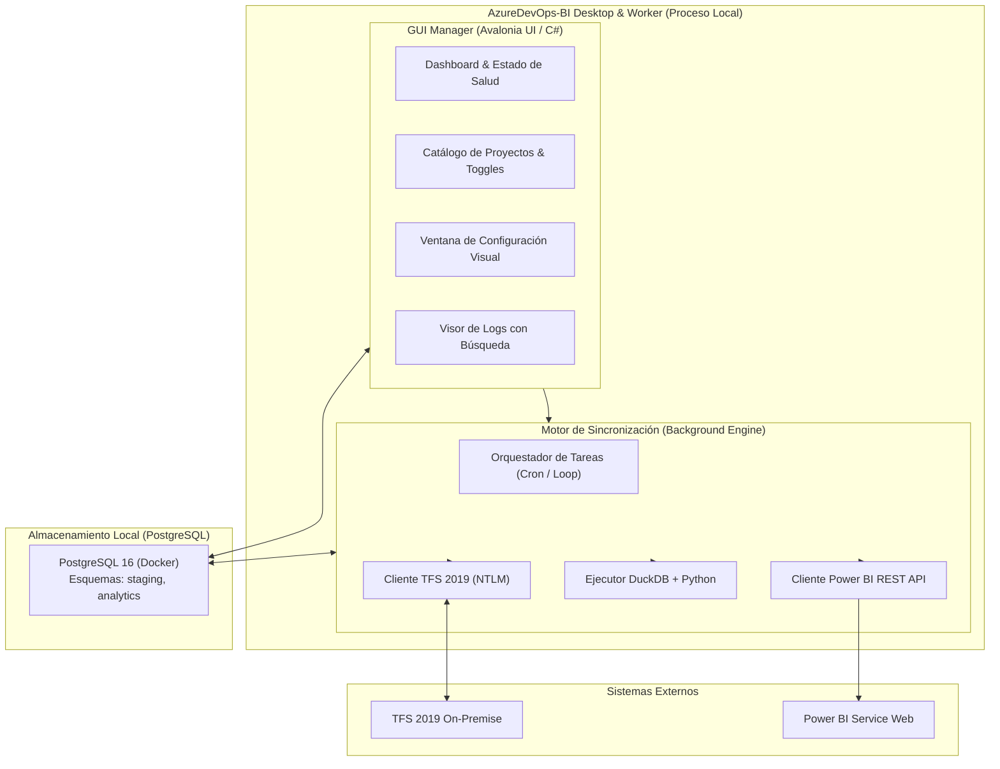

# Guía de Arquitectura General y Handover

## 1. Resumen Ejecutivo
AzureDevOps-BI es una plataforma empresarial desacoplada construida en **.NET 8/9**, **PostgreSQL 16**, **Python (DuckDB + uv)** y **Power BI REST API**. Su objetivo es extraer, modelar y automatizar métricas ágiles y de flujo (Lead Time, Cycle Time, Queue Time, WIP Age, Throughput) desde instancias locales On-Premise de Azure DevOps Server (TFS 2019) hacia Power BI Web.

El proyecto es una aplicación **Desktop Nativa (Avalonia UI)** que actúa como un GUI Manager y orquesta procesos de fondo (Worker) de muy bajo consumo. Está pensada para ejecutarse 100% local en la máquina de un usuario portador (administrador), sin requerir servidores corporativos de recolección ni exposición de puertos de red.

## 2. Diagrama de Arquitectura

## 3. Componentes Principales
1. **AzureDevOps.DesktopManager**: Aplicación Avalonia UI que presenta la interfaz y carga el `IHost` de .NET con los background services.
2. **AzureDevOps.IngestionWorker**: Capa de background services. Contiene `IngestionOrchestratorJob`, encargado del ciclo de extracción (WIQL) de datos delta.
3. **Analytics Engine**: Scripts de Python (`transform_analytics.py`) que usan DuckDB para transformar datos crudos semi-estructurados en un modelo dimensional.
4. **Mock Server**: Servidor mínimo en `AzureDevOps.MockServer` para probar la ingesta y simular respuestas del TFS sin pegarle al servidor real.
5. **PostgreSQL 16**: Base de datos local (dockerizada) para persistir catálogos, configuraciones, watermarks de sincronización (para idempotencia) y los modelos de datos estrella.

## 4. Estructura de Proyectos y Unificación de Hilos (`IHost`)
- `src/AzureDevOps.Core/`: Modelos, interfaces y configuración compartida.
- `src/AzureDevOps.DesktopManager/`: Vistas y ViewModels (Avalonia). **Aquí reside el `AppHost` (`IHost` de .NET)** que unifica la inyección de dependencias. En su `App.axaml.cs`, carga explícitamente el `appsettings.json` del Worker, permitiendo que la interfaz visual y los procesos de fondo compartan el mismo contenedor, configuraciones y ciclo de vida.
- `src/AzureDevOps.IngestionWorker/`: Workers, servicios de TFS, DB, PowerBI y DuckDB.
- `src/AzureDevOps.MockServer/`: Fake TFS API.
- `src/AzureDevOps.SandboxCLI/`: Consola aislada para debug de NTLM.
- `analytics_engine/`: Motor Python/DuckDB.
- `docker/`: Configuración de base de datos PostgreSQL y schema DDL.

## 5. Decisiones Clave (Handover)
- **Cero Instalación / Cero Puertos**: Por restricciones corporativas, la app se compila auto-contenida (Self-Contained) de modo que se puede correr en Windows sin instalar el runtime de .NET. Tampoco levanta puertos HTTP (excepto para DB) evitando colisiones.
- **Autenticación NTLM**: El sistema extrae los datos usando la identidad del usuario logueado en Windows (`UseDefaultCredentials = true`), evitando almacenar contraseñas en plano y protegiendo contra el ciclo de expiración de claves corporativas.
- **Tolerancia a Fallos**: Uso extensivo de Polly para reintentos HTTP, Watermarks en DB para nunca reprocesar lo mismo dos veces ni duplicar datos si se cae la red.

---
*Fin de la Parte 1 - Revisa los demás documentos de la carpeta `documentation/` para detalles de cada componente.*
