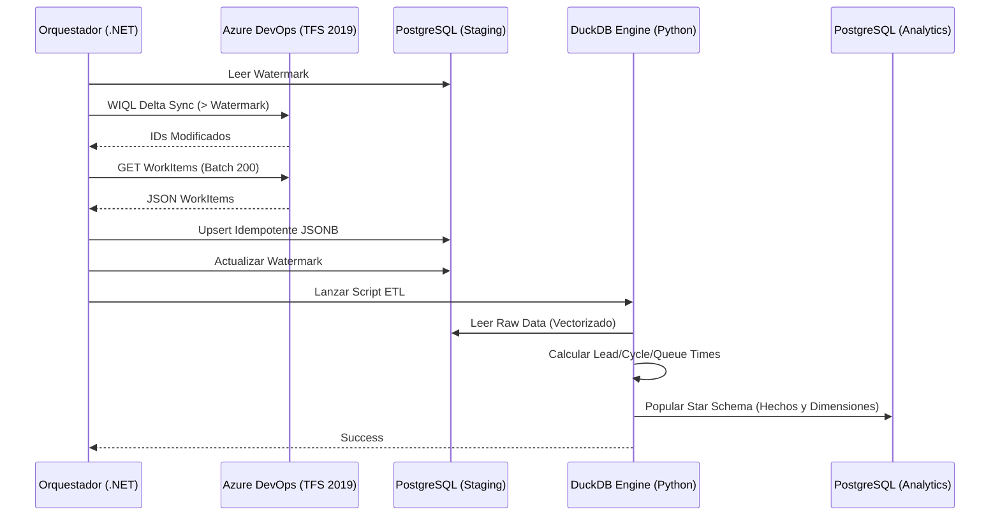

# Proceso de Ingesta, ETL y Analytics

## 1. El Flujo de Ingesta de Datos (Delta Sync)
La extracción de los *Work Items* desde Azure DevOps (TFS 2019) no se hace trayendo toda la historia cada vez, sino utilizando un proceso incremental muy optimizado para cuidar los recursos del servidor corporativo.

1. **Watermarks (Marcas de Agua)**: El sistema lee de la tabla `staging.sync_watermarks` la fecha `last_watermark_utc` para cada proyecto activo.
2. **Consultas WIQL**: Construye un query WIQL (Work Item Query Language) pidiendo exclusivamente los IDs de items cuya `[System.ChangedDate]` sea mayor a dicha marca de agua.
3. **Batching**: Como la API de TFS restringe payloads masivos, se dividen los IDs resultantes en lotes (máximo 200) y se piden los detalles completos usando la expansión `$expand=all`.
4. **Idempotencia Transaccional (Upsert)**: En la clase `WorkItemStagingRepository`, la inserción a base de datos ocurre mediante Dapper en una transacción dura (`BeginTransactionAsync`). Todos los ítems llegan crudos y se guardan (o actualizan) masivamente en `staging.raw_work_items`. Se usa JSONB en Postgres (`fields_json`) para guardar el $100\%$ de los campos. Si la conexión falla a la mitad, la transacción hace *Rollback* automático, impidiendo corrupciones y duplicados.

## 2. Transformación Analítica (DuckDB + Python)
El motor de transformación reside en `analytics_engine/transform_analytics.py`. En lugar de mover gigabytes por la red o saturar memoria en .NET, se utiliza **DuckDB**.

### ¿Cómo interactúa DuckDB con Postgres?
El script `transform_analytics.py` escanea recursivamente buscando archivos `.env` o lee la cadena directa `ConnectionStrings__PostgresDb` del entorno. Extrae los credenciales y conecta DuckDB de forma nativa a la instancia de PostgreSQL en memoria mediante:
```sql
INSTALL postgres;
LOAD postgres;
ATTACH 'host=localhost port=5432 dbname=azure_devops_dw user=postgres password=...' AS pg (TYPE POSTGRES);
```
Luego ejecuta una gran consulta vectorizada que calcula las métricas de flujo y las inserta en el esquema `analytics`.

### Métricas de Flujo Calculadas
- **Lead Time**: Días transcurridos desde que se crea (CreatedDate) hasta que se cierra (ClosedDate).
- **Cycle Time**: Días transcurridos desde que se empieza a trabajar (ActivatedDate) hasta que se cierra.
- **Queue Time**: Días de espera desde que se crea hasta que se activa.
- **WIP Age**: Antigüedad de un ítem en curso (desde ActivatedDate hasta HOY).

### Normalización de Dimensiones
DuckDB lee los campos heterogéneos de diferentes proyectos y los mapea a dimensiones universales en la tabla `dim_state` y `dim_work_item_type`.
- *Categorías de Estado*: `Proposed`, `In Progress`, `Completed`, `Removed`.
- *Categorías de Tipo*: `Epic`, `Feature`, `Requirement`, `Bug`, `Task`.

## 3. Power BI Integration
Al final del pipeline ETL en DuckDB, el orquestador .NET asíncronamente llama a la REST API de Power BI (si está configurada con credenciales OAuth2 / Service Principal) para indicarle al dataset que refresque los datos (ya que el Star Schema en Postgres acaba de ser actualizado).


