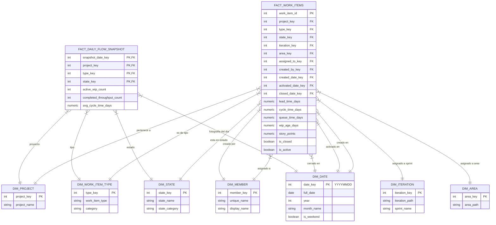

# Modelo de Datos y Entidad Relación (ER)

La base de datos (PostgreSQL 16) está dividida en dos esquemas principales para garantizar el aislamiento entre la ingesta en crudo y la presentación estructurada.

## 1. Esquema `staging`
Utilizado para la persistencia rápida e idempotente de datos provenientes de TFS.

- `catalog_collections`: Lista de colecciones descubiertas.
- `catalog_projects`: Lista de proyectos descubiertos, si están habilitados (toggles UI) y si el portador tiene permisos.
- `system_configuration`: Configuraciones del sistema en formato JSON (URL, Credenciales de Power BI, opciones de UI).
- `sync_watermarks`: Estado de sincronización por entidad/proyecto. Además de la última fecha de modificación procesada (`last_watermark_utc`), monitorea rigurosamente el estado del worker: registra la hora de inicio y fin (`last_sync_start_utc`, `last_sync_end_utc`), la cantidad de registros extraídos en el último lote, y su estado en vivo (`IDLE`, `RUNNING`, `SUCCESS`, `FAILED`), incluyendo cualquier mensaje de error. Asegura que la ingesta continúe desde donde se quedó en caso de fallos.
- `raw_work_items`: Almacena el payload JSON crudo en `fields_json` (JSONB) junto con campos base indexados (`id`, `project_name`, `state`, `changed_date`). Se utiliza upsert (`ON CONFLICT`) sobre la llave principal `id`.
- `system_logs`: Recibe logs provenientes de `ILogger` de .NET para ser mostrados en la vista de la UI.

## 2. Esquema `analytics` (Modelo Estrella / Star Schema)
Un Data Warehouse tradicional estructurado para lectura masiva y conexión a Power BI.

- **Tablas de Dimensión**: `dim_date`, `dim_project`, `dim_work_item_type`, `dim_state`, `dim_iteration`, `dim_area`, `dim_member`. 
- **Tabla de Hechos Principal (`fact_work_items`)**: Contiene un registro por cada ID de Work Item junto con todas sus llaves foráneas y el cálculo de métricas de flujo (Lead, Cycle, Queue, WIP Age) pre-procesadas en columnas continuas numéricas.
- **Tabla de Hechos Snapshot (`fact_daily_flow_snapshot`)**: Almacena instantáneas (snapshots) diarias de trabajos activos (WIP), creados y rendimiento general (Throughput). Es ideal para graficar CFD (Cumulative Flow Diagrams).
- **Vistas**: `vw_throughput_weekly` y `vw_flow_metrics_summary` son vistas simplificadas optimizadas para conectar directamente a dashboards de Kanban.

## 3. Diagrama Entidad-Relación (Modelo Estrella)

